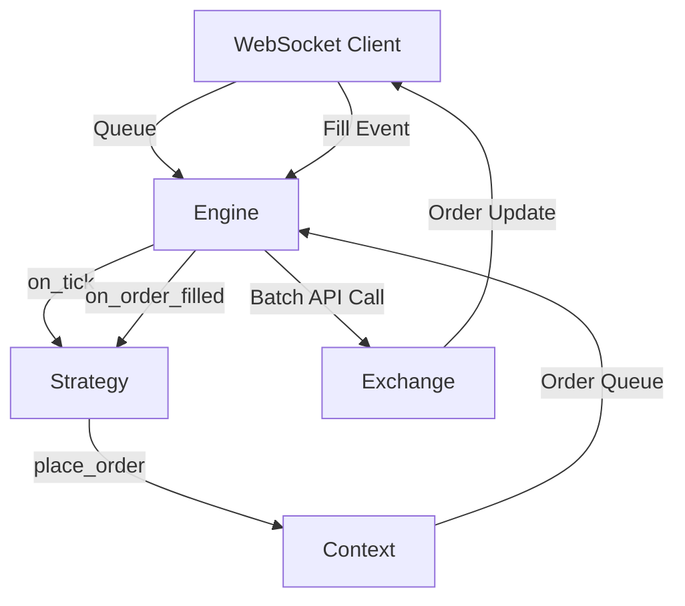

# Lighter Trading Bot - Architecture Guide

## System Overview
The bot is an **Event-Driven, Asynchronous System**. It uses a single-threaded `asyncio` loop to minimize locking complexity.

## Core Components

### 1. Engine (`src/engine/core.py`)
- **Role**: The "Hardware". It handles I/O.
- **Responsibilities**:
  - Maintains `lighter-client` connections.
  - Translates raw WS messages into internal `Trade` / `Order` objects.
  - Batches outgoing orders for efficiency.
  - **CRITICAL**: It catches all strategy exceptions to prevent the bot from crashing.

### 2. Context (`src/engine/context.py`)
- **Role**: The "Sandbox". It limits what the strategy can do.
- **Key Objects**:
  - `MarketInfo`: **MUST** be used for all rounding. `round_price(px)`, `round_size(sz)`.
  - `Balance`: Cached view of account assets. Updated on `on_tick` usually (or via WS events).

### 3. Strategy (`src/strategy/`)
- **Role**: The "Software". It contains the Alpha.
- **Life Cycle**:
  - `__init__`: Setup config.
  - `initialize_zones`: logic to setup grid.
  - `on_tick`: Market data update.
  - `on_order_filled`: Trade update (this is where grid logic usually recycles orders).

## Data Models (`src/model.py`)
- **`Cloid`**: Client Order ID. Strictly typed wrapper around `int` to prevent mixing up IDs.
- **`OrderRequest`**: Base class for `LimitOrderRequest`.
- **`OrderFill`**: Normalized fill event containing fee, role (maker/taker), and size.

## Design Patterns
- **Idempotency**: Strategies should be able to rebuild their state (active orders map) from the `Context` if restarted.
- **Fail-Fast Config**: Invalid config causes immediate crash on startup.
- **Resilient Runtime**: Runtime errors in Strategy are logged but do not crash the Engine (usually).
