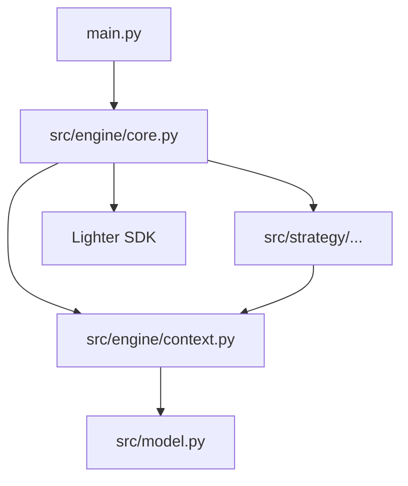

# AGENT.md - Project Guide for AI Coding Agents

## Project Overview
This project is a high-performance trading bot designed for the Lighter exchange. It supports multiple strategies, including Perpetual and Spot Grid Trading, and utilizes the Lighter Python SDK for order execution and market data.

## Architecture

### Components
- **Engine (`src/engine/core.py`)**: The central orchestrator. It initializes API/Signer/WS clients, loads market metadata, and runs the main event loop. It captures tick events and passes them to the Strategy.
- **Strategy (`src/strategy/`)**: Contains the trading logic.
    - `base.py`: Abstract base classes.
    - `perp_grid.py`: Perpetual grid trading logic.
    - `spot_grid.py`: Spot grid trading logic.
- **Context (`src/engine/context.py`)**: Provides a sandbox for strategies. It tracks:
    - `MarketInfo`: Precision, limits, and identifiers for tokens.
    - `Balance`: Spot and Perp balances.
    - `Order Queue`: A list of outgoing order requests.
- **Model (`src/model.py`)**: Shared data structures (e.g., `OrderRequest`, `Cloid`, `OrderFill`).
- **Config (`src/config/`)**: Schema-backed configuration using YAML and Environment variables.

## Development & Execution

### Environment Management
- **Virtual Environment**: This project **requires** the use of a virtual environment located in the `venv/` directory.
- **NEVER** install packages system-wide.
- **NEVER** use `pip install` without prefixing with `venv/bin/`.

### Common Commands
- **Initialization**: `bash setup.sh`
- **Starting the Bot**: `venv/bin/python main.py <config_file>`
- **Running Tests**: `venv/bin/python -m pytest tests/`
- **Linting**: `bash run_mypy.sh`

## Rules for Coding Agents
1. **Tool Usage**: Always use `venv/bin/python` or `venv/bin/pip`.
2. **Code Style**:
    - Use type hints consistently.
    - Follow the existing pattern of using `StrategyContext` to queue orders rather than calling API methods directly from strategies.
3. **Market Metadata**: Use the `MarketInfo` object within the context for all precision-related calculations.
4. **Safety**:
    - Do not modify `.env` or `wallet_config.json` with real keys in a way that could be committed.
    - Ensure all order sizes and prices are rounded according to market rules using `MarketInfo.round_size()` and `MarketInfo.round_price()`.
